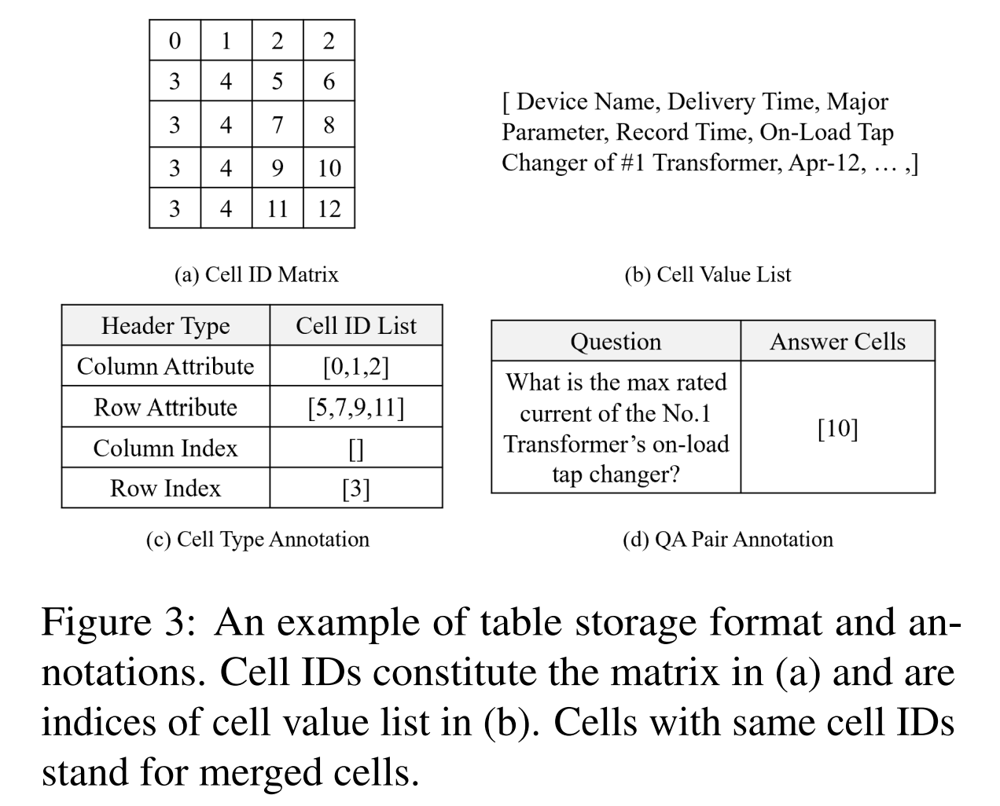

# IM-TQA: A Chinese Table Question Answering Dataset with Implicit and Multi-type Table Structures
Table of contents:

- [1. Dataset Description](#1-dataset-description)
- [2. Considered Table Types and Header Cells](#2-considered-table-types-and-header-cells)
- [3. Table Storage and Annotation](#3-table-storage-and-annotation)
- [4. Sample Format](#4-sample-format)
- [5. Leader Board](#5-leader-board)
- [6. Model Training and Evaluation](#6-model-training-and-evaluation)
- [7. Limitations](#7-limitations)

## 1. Dataset Description

IM-TQA is a Chinese table question answering dataset with **1,200 tables** and **5,000 question-answer pairs**, which highlights **I**mplicit and **M**ulti-type table structures for real-world **TQA** scenarios. **It yields a more challenging table QA setting with two characteristics**: 

1. **models need to handle different types of tables. (i.e., Multi-type)**
2. **header cell annotations are not provided to models directly. (i.e., Implicit)**

By contrast, previous TQA benchmarks mainly focus on limited table types with explicit table structures (i.e., the model knows exactly which cells are headers). **We collect multi-type tables and ask professional annotators to provide the following annotations: (1) table types, (2) header cell locations, (3) natural language look-up questions together with (4) their answer cell locations.** More details, analyses, and baseline results can be found in the [paper](https://aclanthology.org/2023.acl-long.278/).

<p align = "center">    


</p>


## 2. Considered Table Types and Header Cells
As shown in Figure 1, **we divide tables into 4 types according to their structure characteristics**, which is in line with previous works with complex table as an important complement. Exploring and including more table types deserve future investigations.

- **Vertical Table**: Table data is arranged in the vertical direction, with the first row as column headers and other rows as data tuples.
- **Horizontal Table**: Table data is arranged in the horizontal direction, with the first column as row headers and other columns as data tuples.
- **Hierarchical Table**: Table data is arranged in both vertical and horizontal directions, with headers exhibiting a multi-level hierarchical structure.
- **Complex Table**: In tables of above 3 types, header cells only locate on the top or left side of the table. But in complex tables, headers also appear at other positions such as bottom-right region in the table and can be mixed with data cells. Such tabular structures with flexible header locations often appear in professional equipment specifications and record sheets, presenting a great challenge to existing methods.

To promote the understanding of implicit table structures, **we categorize table cells into 5 types based on their functional roles**, with the concentration on header cells that are useful for TQA models to locate correct answer cells.

- **Row Attribute and Column Attribute**: Row attribute and column attribute are traditional table headers which describes other cells in the same row and in the same column respectively, e.g., yellow cells and red cells in Figure 1. Attribute cells only serve the purpose of describing other cells and they are not meaningful data.
- **Row Index and Column Index**: Row index and column index are individual cells that are used to index data records in the row or column orientation, e.g., blue cells and green cells in Figure 1. Index cells are also meaningful data. For instance, in vertical tables, data cells in the primary key column are unique identifiers of each row.
- **Pure Data**: Pure data cells are the core body of a table. They do not have the function of describing or indexing other cells and their meanings should be understood with the help of above header cells.

## 3. Table Storage and Annotation
In order to store various tables, we design a storage method which separately stores cell positions $P$ and cell contents $V$. To store cell positions, a cell ID is assigned to each table cell in the row-first order. For a table including $m$ rows and $n$ columns, its cell IDs constitute an $m×n$ matrix representing cell locations. This matrix contains table layout information such as neighbouring relations between different cells. As for cell contents, every cell value is put into a list in the same row-first order. An example format is shown in Figure 3. Given the cell ID matrix and cell value list, we instructed annotators in distinguishing 5 cell types and asked them to annotate cell ID lists of attribute and index cells. Other table cells are deemed pure data cells. After identifying header cells, we asked annotators to raise look-up questions about data cells and label answer cell IDs.

<p align = "center">    

</p>

## 4. Sample Format
IM-TQA dataset consists of six `.json` files for train/dev/test samples in the `data` directory. `train_tables.json`, `dev_tables.json`, and `test_tables.json` store table data and annotated header cells, and `train_questions.json`, `dev_questions.json`, and `test_questions.json` store question-answer pairs. Table samples and question-answer pairs are dictionary objects. Though IM-TQA is collected from Chinese tables, we adopt [a commercial machine translation model](https://cloud.baidu.com/product/mt/text_trans) to translate tables and questions in IM-TQA from Chinese into English. But it should be noted that we did not double check the translation results so the translation quality may be poor.

Table sample format:
```python
{
  "table_id": "Z56mZoK9",  # unique table id
  "table_type": "vertical",    # table type, possible table types: 'vertical', 'horizontal', 'hierarchical' or 'complex'.
  "file_name": "垂直表格_216",  # chinese table file name
  "cell_ID_matrix": [[0,1,2,3],  # cell_ID_matrix to store table layout information, which consists of several cell ID lists in the in the row-first order, e.g., [0,1,2,3] represents the first row.
                     [4,5,6,7]
                      ,...,],   
  "chinese_cell_value_list":  [ "序号", "客户", "销售金额", "年度销售占比%", "是否存在关联关系",...,], # cell_value_list to store cell content, which can be indexed by the cell ID in the cell_ID_matrix.
  "english_cell_value_list": ["Serial No", "customer", "sales amount", "Proportion of annual sales%",...,],  # cell_value_list translated into English.
  "column_attribute": [0,1,2,3,4],  # annotated cell ID list of different header cells.
  "row_attribute": [],
  "column_index": [],
  "row_index": [5]
}
```

Question-answer pair sample format:
```python
{
    "table_id": "Z56mZoK9",  # table_id is used to index the related table of each question.
    "question_id": "Z56mZoK9_3", # unique question id
    "file_name": "垂直表格_216", # chinese table file name
    "chinese_question": "客户一的销售金额是多少？年度销售占比是多少？", # question text which is raised by annotators
    "english_question": "What is the sales amount of Customer 1? What is the percentage of annual sales?", # english question text
    "answer_cell_list": [7, 8], # cell id list of answer cells
    "question_type": "arbitrary_cells"  # question type, possible question types: 'single_cell', 'one_row', 'one_col' and 'arbitrary_cells'.
}
```

The dataset split statistics are shown below:
|                        | Train | Valid | Split | Total |
| :--------------------- | :---- | :---- | :---- | :---- |
| \# tables              | 936   | 111   | 153   | 1200  |
| \# questions           | 3909  | 464   | 627   | 5000  |
| \# vertical tables     | 224   | 31    | 45    | 300   |
| \# horizontal tables   | 230   | 34    | 36    | 300   |
| \# hierarchical tables | 231   | 35    | 34    | 300   |
| \# complex tables      | 251   | 11    | 38    | 300   |

## 5. Leader Board
We evaluate traditional TQA methods and recent powerful large language models (LLMs) like ChatGPT. (The LLM's output files are stored in the `llm_outputs` directory.) From the results shown below, we can find that ChatGPT performs pretty well in handing look-up questions which select specific table cells as answers. This also demonstrates that more complicated questions are needed to present a comprehensive evaluation of LLM's table understanding ability. Some recent studies have made valid progress towards this goal, e.g., [[1]](https://arxiv.org/abs/2305.13062), [[2]](https://arxiv.org/abs/2204.00498).

<table style="border-collapse: collapse; border: none; border-spacing: 0px;">
  <tr>
    <td rowspan="2" style="border-right: 1px solid black; border-top: 1px solid black; border-bottom: 1px solid black; padding-right: 3pt; padding-left: 3pt;">
      <b>Model</b>
    <td colspan="5" style="border-top: 1px solid black; border-bottom: 1px solid black; text-align: center; padding-right: 3pt; padding-left: 3pt;">
      <b>Exact Match Acc(%)</b>
  <tr>
    <td style="border-bottom: 1px solid black; text-align: center; padding-right: 3pt; padding-left: 3pt;">
      All Tables
    <td style="border-bottom: 1px solid black; text-align: center; padding-right: 3pt; padding-left: 3pt;">
      Vertical
    <td style="border-bottom: 1px solid black; text-align: center; padding-right: 3pt; padding-left: 3pt;">
      Horizontal
    <td style="border-bottom: 1px solid black; text-align: center; padding-right: 3pt; padding-left: 3pt;">
      Hierarchical
    <td style="border-bottom: 1px solid black; text-align: center; padding-right: 3pt; padding-left: 3pt;">
      Complex
  <tr>
    <td style="border-right: 1px solid black; border-bottom: 1px solid black; padding-right: 3pt; padding-left: 3pt;">
      Ernie-Layout
    <td style="border-bottom: 1px solid black; text-align: center; padding-right: 3pt; padding-left: 3pt;">
      11.6
    <td style="border-bottom: 1px solid black; text-align: center; padding-right: 3pt; padding-left: 3pt;">
      11.5
    <td style="border-bottom: 1px solid black; text-align: center; padding-right: 3pt; padding-left: 3pt;">
      4.10
    <td style="border-bottom: 1px solid black; text-align: center; padding-right: 3pt; padding-left: 3pt;">
      5.66
    <td style="border-bottom: 1px solid black; text-align: center; padding-right: 3pt; padding-left: 3pt;">
      22.6
  <tr>
    <td style="border-right: 1px solid black; border-bottom: 1px solid black; padding-right: 3pt; padding-left: 3pt;">
      Tapex
    <td style="border-bottom: 1px solid black; text-align: center; padding-right: 3pt; padding-left: 3pt;">
      13.1
    <td style="border-bottom: 1px solid black; text-align: center; padding-right: 3pt; padding-left: 3pt;">
      14.9
    <td style="border-bottom: 1px solid black; text-align: center; padding-right: 3pt; padding-left: 3pt;">
      10.7
    <td style="border-bottom: 1px solid black; text-align: center; padding-right: 3pt; padding-left: 3pt;">
      8.18
    <td style="border-bottom: 1px solid black; text-align: center; padding-right: 3pt; padding-left: 3pt;">
      17.4
  <tr>
    <td style="border-right: 1px solid black; border-bottom: 1px solid black; padding-right: 3pt; padding-left: 3pt;">
      RAT
    <td style="border-bottom: 1px solid black; text-align: center; padding-right: 3pt; padding-left: 3pt;">
      18.5
    <td style="border-bottom: 1px solid black; text-align: center; padding-right: 3pt; padding-left: 3pt;">
      34.5
    <td style="border-bottom: 1px solid black; text-align: center; padding-right: 3pt; padding-left: 3pt;">
      33.6
    <td style="border-bottom: 1px solid black; text-align: center; padding-right: 3pt; padding-left: 3pt;">
      5.03
    <td style="border-bottom: 1px solid black; text-align: center; padding-right: 3pt; padding-left: 3pt;">
      4.07
  <tr>
    <td style="border-right: 1px solid black; border-bottom: 1px solid black; padding-right: 3pt; padding-left: 3pt;">
      TAPAS
    <td style="border-bottom: 1px solid black; text-align: center; padding-right: 3pt; padding-left: 3pt;">
      33.2
    <td style="border-bottom: 1px solid black; text-align: center; padding-right: 3pt; padding-left: 3pt;">
      58.0
    <td style="border-bottom: 1px solid black; text-align: center; padding-right: 3pt; padding-left: 3pt;">
      31.1
    <td style="border-bottom: 1px solid black; text-align: center; padding-right: 3pt; padding-left: 3pt;">
      26.4
    <td style="border-bottom: 1px solid black; text-align: center; padding-right: 3pt; padding-left: 3pt;">
      15.7
  <tr>
    <td style="border-right: 1px solid black; border-bottom: 1px solid black; padding-right: 3pt; padding-left: 3pt;">
      RCI
    <td style="border-bottom: 1px solid black; text-align: center; padding-right: 3pt; padding-left: 3pt;">
      47.2
    <td style="border-bottom: 1px solid black; text-align: center; padding-right: 3pt; padding-left: 3pt;">
      68.4
    <td style="border-bottom: 1px solid black; text-align: center; padding-right: 3pt; padding-left: 3pt;">
      45.1
    <td style="border-bottom: 1px solid black; text-align: center; padding-right: 3pt; padding-left: 3pt;">
      56.0
    <td style="border-bottom: 1px solid black; text-align: center; padding-right: 3pt; padding-left: 3pt;">
      19.2
  <tr>
    <td style="border-right: 1px solid black; border-bottom: 1px solid black; padding-right: 3pt; padding-left: 3pt;">
      RCI-AIT
    <td style="border-bottom: 1px solid black; text-align: center; padding-right: 3pt; padding-left: 3pt;">
      49.6
    <td style="border-bottom: 1px solid black; text-align: center; padding-right: 3pt; padding-left: 3pt;">
      69.5
    <td style="border-bottom: 1px solid black; text-align: center; padding-right: 3pt; padding-left: 3pt;">
      43.4
    <td style="border-bottom: 1px solid black; text-align: center; padding-right: 3pt; padding-left: 3pt;">
      60.4
    <td style="border-bottom: 1px solid black; text-align: center; padding-right: 3pt; padding-left: 3pt;">
      23.8
  <tr>
    <td style="border-right: 1px solid black; border-bottom: 1px solid black; padding-right: 3pt; padding-left: 3pt;">
      RGCN-RCI
    <td style="border-bottom: 1px solid black; text-align: center; padding-right: 3pt; padding-left: 3pt;">
      53.4
    <td style="border-bottom: 1px solid black; text-align: center; padding-right: 3pt; padding-left: 3pt;">
      70.7
    <td style="border-bottom: 1px solid black; text-align: center; padding-right: 3pt; padding-left: 3pt;">
      45.9
    <td style="border-bottom: 1px solid black; text-align: center; padding-right: 3pt; padding-left: 3pt;">
      62.9
    <td style="border-bottom: 1px solid black; text-align: center; padding-right: 3pt; padding-left: 3pt;">
      32.0
  <tr>
    <td style="border-right: 1px solid black; border-bottom: 1px solid black; padding-right: 3pt; padding-left: 3pt;">
      <b>ChatGPT </b>
      <br>
      <b>(zero-shot)</b>
    <td style="border-bottom: 1px solid black; text-align: center; padding-right: 3pt; padding-left: 3pt;">
      <b>92.3</b>
    <td style="border-bottom: 1px solid black; text-align: center; padding-right: 3pt; padding-left: 3pt;">
      <b>93.1</b>
    <td style="border-bottom: 1px solid black; text-align: center; padding-right: 3pt; padding-left: 3pt;">
      <b>92.6</b>
    <td style="border-bottom: 1px solid black; text-align: center; padding-right: 3pt; padding-left: 3pt;">
      <b>91.2</b>
    <td style="border-bottom: 1px solid black; text-align: center; padding-right: 3pt; padding-left: 3pt;">
      <b>92.2</b>
  <tr>
    <td style="border-right: 1px solid black; border-bottom: 1px solid black; padding-right: 3pt; padding-left: 3pt;">
      Human
    <td style="border-bottom: 1px solid black; text-align: center; padding-right: 3pt; padding-left: 3pt;">
      95.1
    <td style="border-bottom: 1px solid black; text-align: center; padding-right: 3pt; padding-left: 3pt;">
      96.6
    <td style="border-bottom: 1px solid black; text-align: center; padding-right: 3pt; padding-left: 3pt;">
      95.1
    <td style="border-bottom: 1px solid black; text-align: center; padding-right: 3pt; padding-left: 3pt;">
      94.3
    <td style="border-bottom: 1px solid black; text-align: center; padding-right: 3pt; padding-left: 3pt;">
      94.1
</table>

## 6. Model Training and Evaluation
### 6.1 Environment Setup
```shell
conda create -n IM_TQA python=3.7
conda activate IM_TQA
pip install -r requirements.txt
```
### 6.2 RGCN for Cell Type Classification (CTC)

#### Step 1: Convert Tables into Heterogeneous Graphs in PGL
The 'init_embedding_model' is the model name which is used to encode cell text to 768-dim semantic features. It will be passed to model.from_pretrained() and you can change the code to set it to the local path of your pre-downloaded model. The resulting PGL graph objects will be saved as pickle files (.pkl).
``` shell
cd CTC_code
python convert_tables_to_graphs.py \
--tables_dir='../data/' \
--saved_graphs_dir='../data/' \
--init_embedding_model='bert-base-chinese'
# or you can directly run: sh build_graphs_based_on_tables.sh 
```
#### Step 2: Train an AutoEncoder 
The auto encoder is used to convert discrete 24-dim manual features to continuous 32-dim features. The resulting 32-dim cell features of each table will also be saved as pickle files (.pkl).
``` shell
CUDA_VISIBLE_DEVICES=0 nohup python train_auto_encoder.py \
--run_num=1 \
--enc_hidden_dim=32 \
--manual_feat_dim=24 \
--random_seed=12345 \
--data_dir='../data/' \ 
--feats_save_dir='../data/' \ 
--model_save_dir='./saved_models/ctc_auto_encoder/' > ./log_files/train_auto_encoder_to_encode_manual_cell_feats.log &
# or you can directly run: sh train_auto_encoder.sh
```
#### Step 3: Include 32-dim features to existing graphs to obtain final graphs
``` shell
python3 add_manual_feats_to_table_graphs.py
```
Make sure data paths in 'add_manual_feats_to_table_graphs.py' are correct and the resulting heter graphs with node features of two types will be saved as pickle files (.pkl).
#### Step 4: Train an R-GCN model for CTC task
This script will train an R-GCN model for CTC task using constructed heterogeneous graphs of the train split. It will save the best CTC model based on performance on validation split and predicted results (CTC task) of tables of each split will be saved for the subsequent table question answering (TQA) task. You can also save model of each epoch and select the best model based on you own metric.
``` shell
sh train_ctc_gnn.sh
```

### 6.3 RCI for Table Question Answering (TQA)
TODO

## 7. Limitations
Though we made the first exploration towards real-life TQA scenarios with implicit and multi-type tables, this work faces some limitations:
- Our proposed dataset is in Chinese and focuses on single table. Though we translate the dataset from Chinese into English, we think it is better to directly construct a corresponding large-scale English TQA dataset in consideration of data quality. To build such a dataset with limited resource, one can fully utilize abundant tables in existing English TQA datasets.
- This work focuses on *Lookup* questions and more complicated questions which need multi-hop reasoning and numerical calculations are needed.
- Besides, more delicate taxonomies of table type and cell type also deserve future explorations.


## Reference
If you find this work useful, please considering cite our work:

```
@inproceedings{zheng-etal-2023-im,
    title = "{IM}-{TQA}: A {C}hinese Table Question Answering Dataset with Implicit and Multi-type Table Structures",
    author = "Zheng, Mingyu  and
      Hao, Yang  and
      Jiang, Wenbin  and
      Lin, Zheng  and
      Lyu, Yajuan  and
      She, QiaoQiao  and
      Wang, Weiping",
    booktitle = "Proceedings of the 61st Annual Meeting of the Association for Computational Linguistics (Volume 1: Long Papers)",
    month = jul,
    year = "2023",
    address = "Toronto, Canada",
    publisher = "Association for Computational Linguistics",
    url = "https://aclanthology.org/2023.acl-long.278",
    doi = "10.18653/v1/2023.acl-long.278",
    pages = "5074--5094",
}
```

## License
This dataset follows the Computational Use of Data Agreement v1.0.

## Contact
Despite our best efforts, there maybe still some errors in this dataset. If you have any question regarding the IM-TQA dataset, please create an issue in this repository. You can also reach us by e-mail addresses in the paper.

