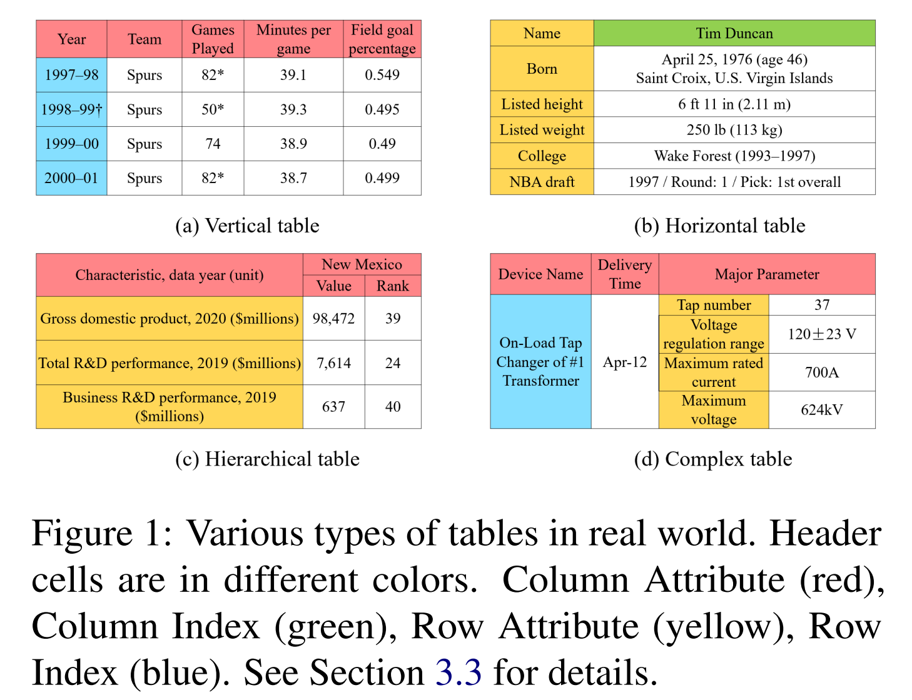

# IM-TQA: A Chinese Table Question Answering Dataset with Implicit and Multi-type Table Structures
## Dataset Description

IM-TQA is a chinese table question answering dataset with **1,200 tables** and **5,000 question-answer pairs**, which highlights **I**mplicit and **M**ulti-type table structures for real-world **TQA** scenarios. **It yields a more challenging table QA setting where models need to handle different types of tables and header cell annotations are not provided to models directly**, which is illustrated in Figure 2. By contrast, previous TQA benchmarks mainly focus on limited table types with explicit table structures (i.e., the model knows exactly which cells are headers). We collect multi-type tables and ask professional annotators to annotate header cell locations, natural language look-up questions together with their answer cell locations. More details, analyses, and baseline results can be found in the [paper](https://aclanthology.org/2023.acl-long.278/).

<p align = "center">    


</p>


## Considered Table Types and Header Cells
As shown in Figure 1, we divide tables into 4 types according to their structure characteristics, which is in line with previous works with complex table as an important complement. Exploring and including more table types deserve future investigations.

- **Vertical Table**: Table data is arranged in the vertical direction, with the first row as column headers and other rows as data tuples.
- **Horizontal Table**: Table data is arranged in the horizontal direction, with the first column as row headers and other columns as data tuples.
- **Hierarchical Table**: Table data is arranged in both vertical and horizontal directions, with headers exhibiting a multi-level hierarchical structure.
- **Complex Table**: In tables of above 3 types, header cells only locate on the top or left side of the table. But in complex tables, headers also appear at other positions such as bottom-right region in the table and can be mixed with data cells. Such tabular structures with flexible header locations often appear in professional equipment specifications and record sheets, presenting a great challenge to existing methods.

To promote the understanding of implicit table structures, we categorize table cells into 5 types based on their functional roles, with the concentration on header cells that are useful for TQA models to locate correct answer cells.

- **Row Attribute and Column Attribute**: Row attribute and column attribute are traditional table headers which describes other cells in the same row and in the same column respectively, e.g., yellow cells and red cells in Figure 1. Attribute cells only serve the purpose of describing other cells and they are not meaningful data.
- **Row Index and Column Index**: Row index and column index are individual cells that are used to index data records in the row or column orientation, e.g., blue cells and green cells in Figure 1. Index cells are also meaningful data. For instance, in vertical tables, data cells in the primary key column are unique identifiers of each row.
- **Pure Data**: Pure data cells are the core body of a table. They do not have the function of describing or indexing other cells and their meanings should be understood with the help of above header cells.

## Table Storage and Annotation
In order to store various tables, we design a storage method which separately stores cell positions $P$ and cell contents $V$. To store cell positions, a cell ID is assigned to each table cell in the row-first order. For a table including $m$ rows and $n$ columns, its cell IDs constitute an $m×n$ matrix representing cell locations. This matrix contains table layout information such as neighbouring relations between different cells. As for cell contents, every cell value is put into a list in the same row-first order. An example format is shown in Figure 3. Given the cell ID matrix and cell value list, we instructed annotators in distinguishing 5 cell types and asked them to annotate cell ID lists of attribute and index cells. Other table cells are deemed pure data cells. After identifying header cells, we asked annotators to raise questions about data cells and label answer cell IDs.

<p align = "center">    

</p>

## Sample Format
IM-TQA dataset consists of six '.json' files for train/dev/test samples in the 'data' directory. 'train_tables.json', 'dev_tables.json', and 'test_tables.json' store table data and annotated header cells, and 'train_questions.json', 'dev_questions.json', and 'test_questions.json' store question-answer pairs. Table samples and question-answer pairs are dictionary objects with several fields.

Table sample format:
```python
{
  "table_id": "Z56mZoK9",  # unique table id
  "table_type": "vertical",    # table type, e.g., 'vertical', 'horizontal', 'hierarchical' or 'complex'.
  "file_name": "垂直表格_216",  # chinese table file name
  "cell_ID_matrix": [[0,1,2,3],  # cell_ID_matrix to store table layout information
                     [4,5,6,7]...]   
  "chinese_cell_value_list":
}
```


## Leader Board

## Limitations

## Reference

## License


